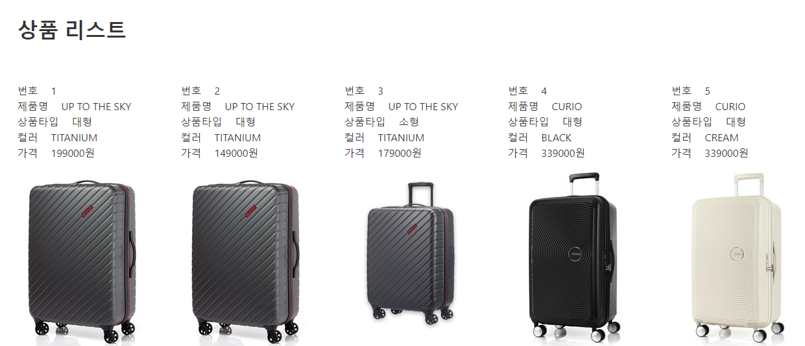
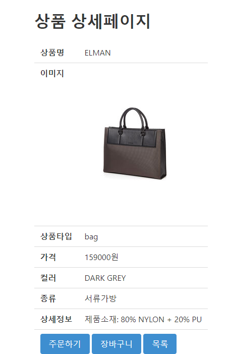

# Project  1
## 아메리칸 투어리스터 웹 애플리케이션
가방 쇼핑몰

- 개발 환경 : JAVA 1.8, Eclipse 2021-09(4.21.0), Apache Tomcat 9.0, Oracle XE 11g
- 주요 기술 : Java/JSP, jUnit4, JavaScript, HTML/CSS, MVC2 Pttern, Jquery
- 수행 기간 : 2022.05.19 ~ 2022.06.07
- 구현 내용    

    1. 메인화면

        

    #
    2. 회원기능

         
        
        * 입력한 아이디값을 파라미터로 받아서 member테이블에서 select하여 같은 아이디가 조회되지 않을 경우 회원가입처리
        

    #
    3. 상품

            
        * 상품의 타입과 크기에 따라 조회
        
        * 상품 상세페이지를 통해 상품을 주문하거나 장바구니에 담을 수 있게 구현
    #
    4. 장바구니

        
        * 주문하면 장바구니에 담겨있던 상품 삭제

    #
    5. 주문

        
        * 마이페이지의 주문목록에서 주문내용을 확인할 수 있으며 상품 준비중 상태에서는 배송지 수정이나, 주문 취소가 가능
        * 주문한 수량만큼 상품재고 감소, 주문 취소시 취소한 수량만큼 재고 증가처리
        * 배송정보가 배송완료되면 리뷰작성이 가능하고 리뷰는 한 주문번호당 한번만 작성가능

    #
    6. 관리자

          
        * 관리자 아이디로 로그인시 공지, 화원, 제품, 판매, Q&A, 접속자 관리가 가능

        
       * 공지사항 제목이나 내용의 일부를 검색하여 목록을 불러올 수 있다.

       
       * 고객 정보를 확인하고 수정, 삭제할 수 있다.

       
       
       * 상품을 등록하거나 수정할 수 있다. 조건문으로 이미지를 수정할 경우와 수정하지 않을 경우를 나눠서 처리

        #
        #
- 테이블설계
       
